# 🎬 Movix – Website Xem Phim Trực Tuyến

## 📌 Giới thiệu

**Movix** là một nền tảng xem phim trực tuyến (OTT – Over The Top) được xây dựng trên WordPress, mang đến trải nghiệm giải trí hiện đại tương tự Netflix/Disney+. Website cho phép người dùng duyệt, tìm kiếm và xem phim lẻ, phim bộ (TV Shows) với giao diện thân thiện, đẹp mắt và tối ưu trên mọi thiết bị.

### ✨ Tính năng nổi bật

- 🎥 **Xem phim trực tuyến** – Hỗ trợ phát video nhúng YouTube & HLS (.m3u8)
- 🔍 **Tìm kiếm thông minh** – Tìm theo tên phim, diễn viên, đạo diễn, thể loại, năm phát hành
- 📂 **Phân loại phong phú** – Thể loại, quốc gia, chất lượng, ngôn ngữ, diễn viên, đạo diễn
- 🏆 **Top 10 & Trending** – Bảng xếp hạng phim hot, xu hướng, phim mới ra mắt
- ❤️ **Danh sách yêu thích** – Lưu phim vào My List cá nhân
- 📜 **Lịch sử xem** – Tự động ghi nhớ tiến trình xem trên thiết bị
- 👤 **Trang cá nhân** – Quản lý tài khoản, hồ sơ người dùng
- 💎 **Gói VIP** – Trang đăng ký gói Premium với giao diện pricing hiện đại
- 📱 **Responsive Design** – Tương thích hoàn hảo trên Desktop, Tablet, Mobile
- 🌙 **Dark Mode** – Giao diện tối chủ đạo, phong cách OTT cao cấp

---

## 📸 Hình ảnh minh họa

### Giao diện người dùng (Frontend)

#### 🏠 Trang chủ – Hero Banner

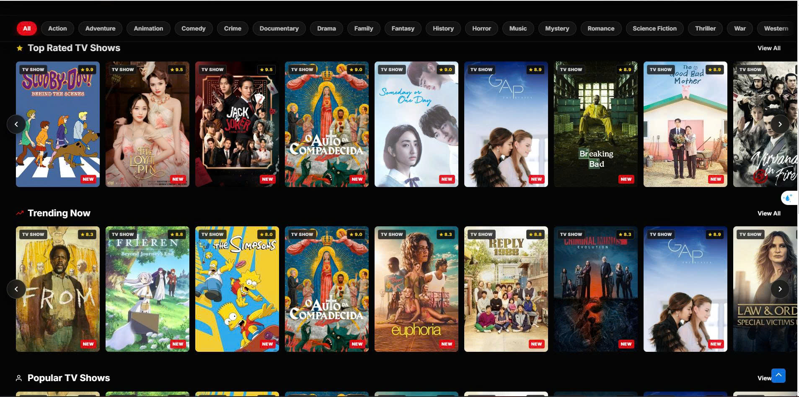

> Trang chủ với Hero Banner toàn màn hình, hiển thị phim nổi bật "The Way to the Heart" kèm nút Play Now, More Info và My List.

#### 🔥 Trang chủ – Trending Now & Top 10 Today

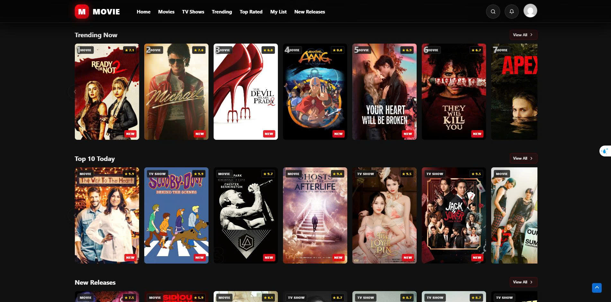

> Các hàng carousel Trending Now (có số thứ tự) và Top 10 Today với poster, rating sao và badge NEW.

#### ⭐ Trang chủ – Top Rated TV Shows & Trending Now

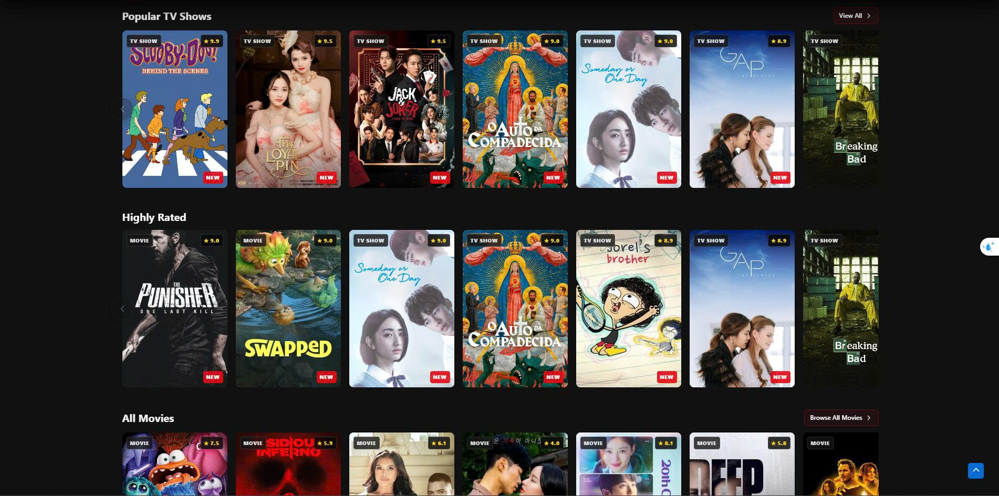

> Bộ lọc thể loại (All, Action, Adventure,...), Top Rated TV Shows và Trending Now carousel.

#### 📺 Trang chủ – Popular TV Shows & Highly Rated

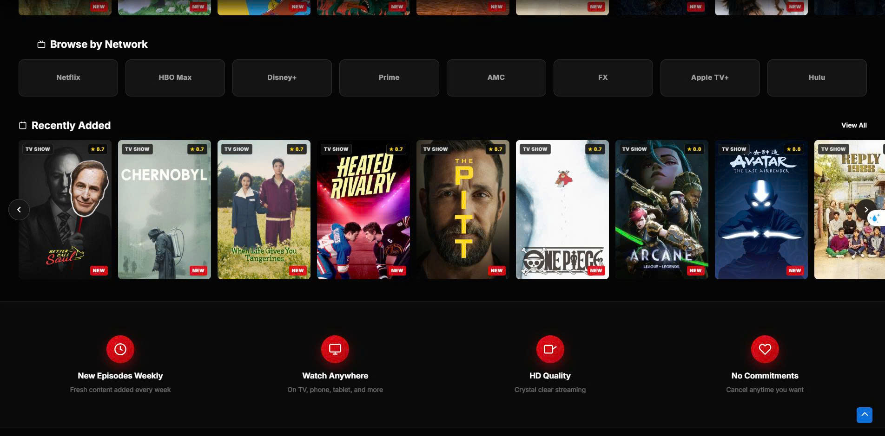

> Carousel Popular TV Shows và section Highly Rated với phim lẻ & phim bộ, All Movies bên dưới.

#### 📡 Trang chủ – Browse by Network & Recently Added

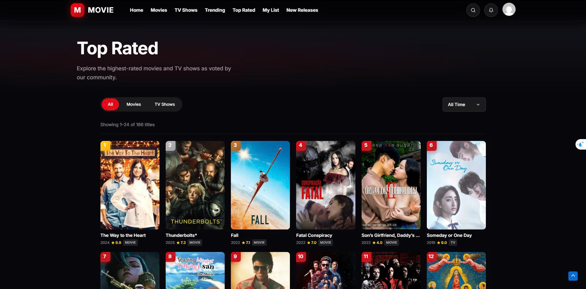

> Browse by Network (Netflix, HBO Max, Disney+,...), Recently Added carousel và các feature highlights.

#### 🎬 Trang chủ – All Movies & Footer

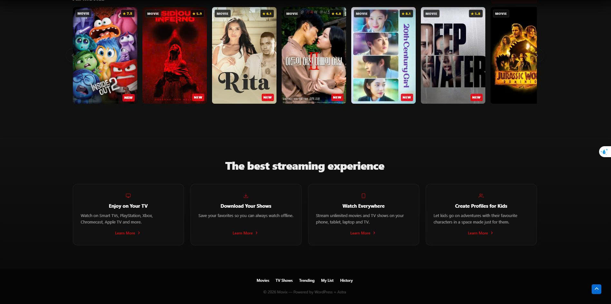

> Section All Movies, "The best streaming experience" với 4 feature cards và footer navigation.

#### 📈 Trang Trending

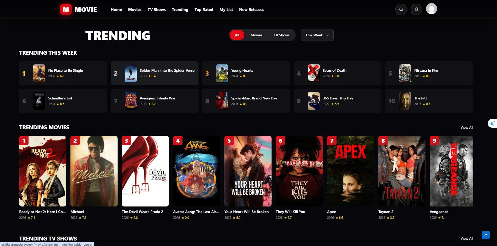

> Trang Trending với bộ lọc All/Movies/TV Shows, bảng xếp hạng Trending This Week (Top 10) và grid Trending Movies.

#### 🏆 Trang Top Rated

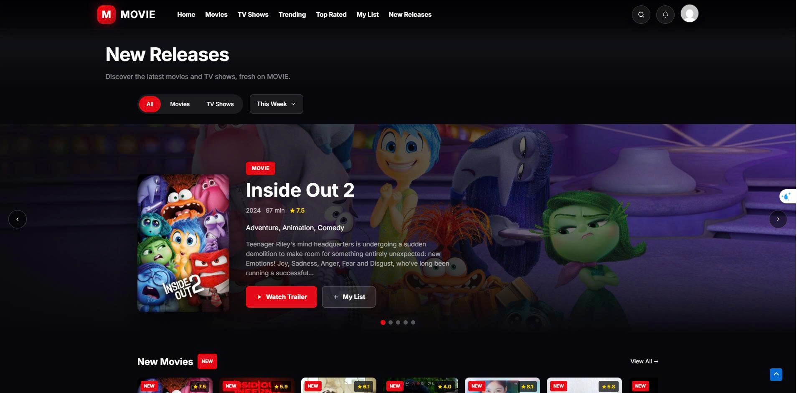

> Trang Top Rated hiển thị 186 titles được đánh giá cao nhất, bộ lọc All/Movies/TV Shows và All Time.

#### 🆕 Trang New Releases

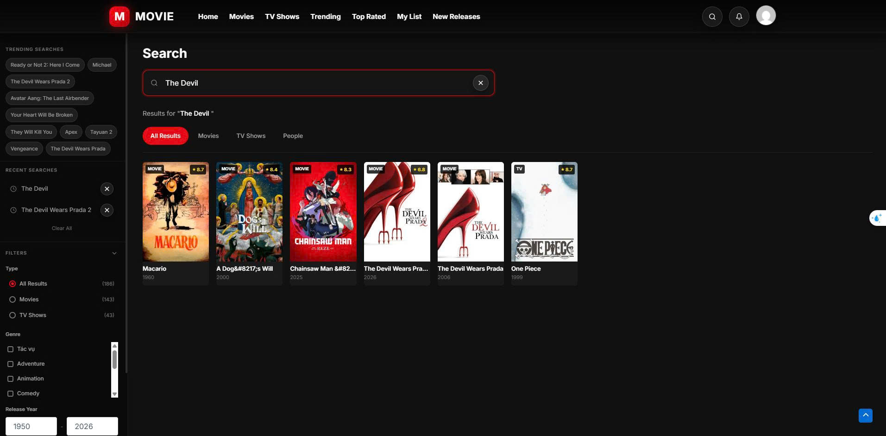

> Phim mới ra mắt với hero carousel chi tiết (Inside Out 2), nút Watch Trailer, My List và section New Movies.

#### 🔍 Trang Tìm kiếm

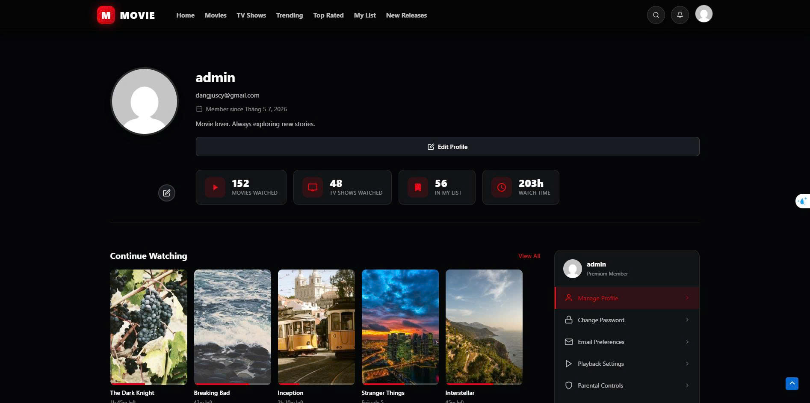

> Tìm kiếm thông minh với Trending Searches, Recent Searches, bộ lọc nâng cao (Type, Genre, Release Year) và kết quả tìm kiếm.

#### ❤️ Trang My List (Yêu thích)

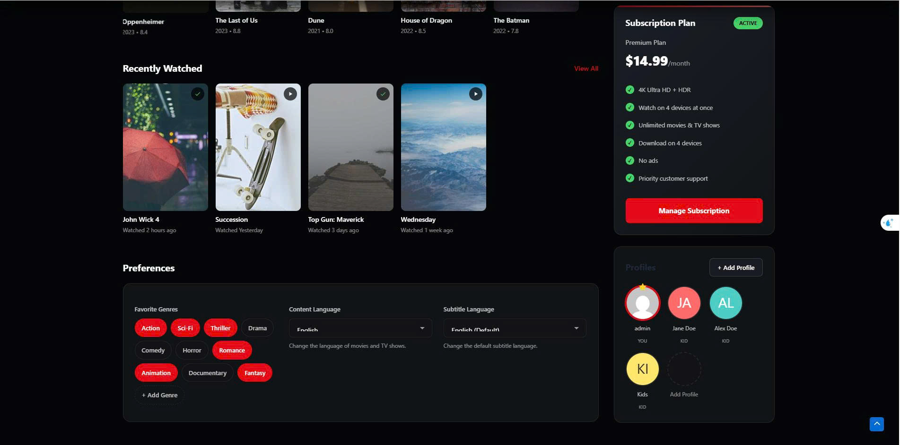

> Danh sách phim yêu thích cá nhân với thống kê (Movies, TV Shows, Watch Time), Continue Watching, bộ lọc Sort By/Type/Genre.

#### 👤 Trang Cá nhân (Profile) – Thông tin & Thống kê

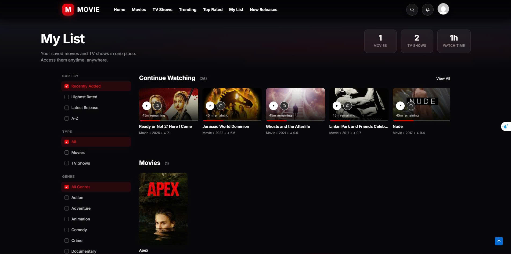

> Trang hồ sơ người dùng với avatar, thống kê xem phim (152 Movies, 48 TV Shows, 56 In My List, 203h Watch Time), Continue Watching và menu quản lý.

#### 👤 Trang Cá nhân (Profile) – Cài đặt & Subscription

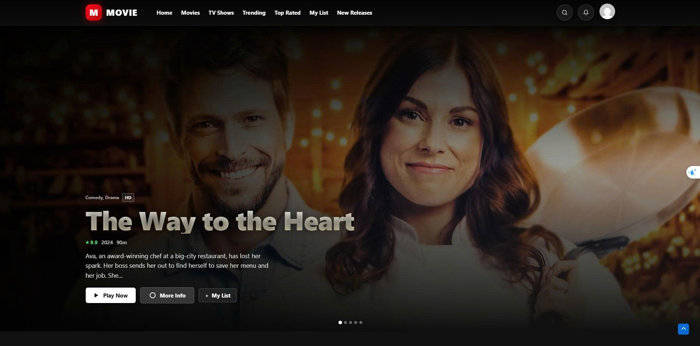

> Recently Watched, Preferences (Favorite Genres, Content Language, Subtitle), Subscription Plan (Premium $14.99/month) và quản lý Profiles.

#### 📜 Trang Lịch sử xem & Menu người dùng

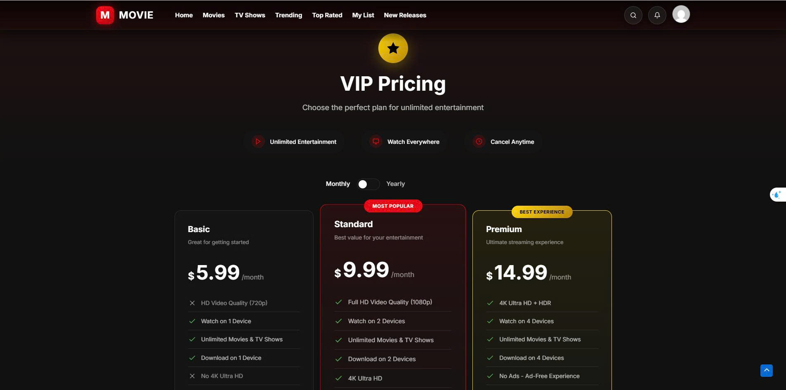

> Watch History với bộ lọc (All History, Movies, TV Shows), Time Period filter và dropdown menu người dùng (Profile, My List, History, VIP Membership, Logout).

#### 💎 Trang VIP Pricing – Bảng giá

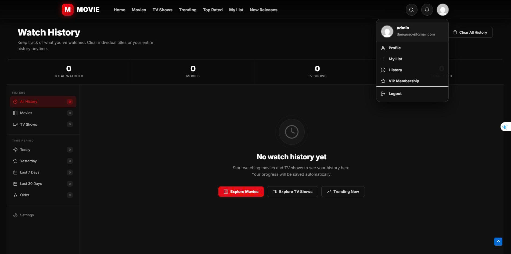

> Bảng giá gói VIP với 3 mức Basic ($5.99), Standard ($9.99), Premium ($14.99), toggle Monthly/Yearly và Secure Payment badges.

#### 💎 Trang VIP Pricing – So sánh & FAQ

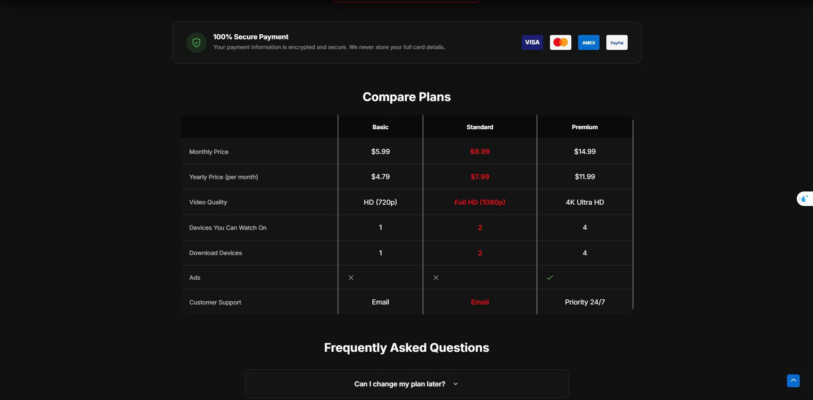

> Bảng Compare Plans chi tiết (Video Quality, Devices, Download, Ads, Support) và section Frequently Asked Questions.

---

## 👥 Danh sách thành viên & Phân công nhiệm vụ

| STT | Họ và tên           | MSSV          | Nhiệm vụ                                                                                                                                                             |
| --- | ------------------- | ------------- | -------------------------------------------------------------------------------------------------------------------------------------------------------------------- |
| 1   | [Đặng Thị Linh]     | [23810310216] | Quản lý dự án. Setup môi trường WordPress, cấu hình Theme Astra & Astra Child. Khởi tạo cấu trúc CSDL bằng CPT UI và Advanced Custom Fields (ACF). Tổng hợp báo cáo. |
| 2   | [Phạm Bảo An]       | [23810310168] | Xử lý logic và hiển thị giao diện trang chủ, các danh mục phim. Tối ưu hóa UI/UX dựa trên các mẫu của Astra Sites. Đảm bảo giao diện Responsive                      |
| 3   | [Đỗ Tiến Nhật Minh] | [23810310174] | Chịu trách nhiệm luồng xử lý và hiển thị dữ liệu phim (Data mapping các trường \_tmdb_id, \_backdrop_path, \_cast, \_crew). Xử lý hiển thị Video/Trailer.            |
| 4   | [Nguyễn Trung Kiên] | [23810310185] | Quản lý người dùng, thiết lập plugin bảo mật/chống spam (Akismet). Hỗ trợ đưa dữ liệu test (SQL Dump) vào hệ thống và tối ưu Database wp_postmeta.                   |

---

## 🛠️ Công nghệ sử dụng

| STT | Công nghệ           | Phiên bản | Mục đích sử dụng                                   |
| --- | ------------------- | --------- | -------------------------------------------------- |
| 1   | **WordPress**       | 6.x       | Hệ thống quản trị nội dung (CMS)                   |
| 2   | **PHP**             | 8.2       | Ngôn ngữ lập trình phía server                     |
| 3   | **MySQL / MariaDB** | 10.x      | Hệ quản trị cơ sở dữ liệu                          |
| 4   | **HTML5 / CSS3**    | —         | Xây dựng cấu trúc và giao diện website             |
| 5   | **JavaScript**      | ES6+      | Xử lý tương tác phía client                        |
| 6   | **Swiper.js**       | 11        | Tạo carousel / slider hiệu ứng trượt               |
| 7   | **HLS.js**          | 1.5.18    | Phát video HLS (.m3u8 streaming)                   |
| 8   | **Astra Theme**     | —         | Theme WordPress cha (parent theme)                 |
| 9   | **TMDB API**        | v3        | Import metadata phim tự động                       |
| 10  | **XAMPP**           | —         | Môi trường phát triển local (Apache + MySQL + PHP) |

---

## 📦 Hướng dẫn cài đặt

### Yêu cầu hệ thống

- **XAMPP** phiên bản 8.x trở lên (bao gồm Apache, MySQL, PHP)
- **Trình duyệt web** hiện đại (Chrome, Firefox, Edge,...)
- **Git** (tùy chọn, để clone project)

### Các bước cài đặt

#### Bước 1: Cài đặt XAMPP

1. Tải và cài đặt [XAMPP](https://www.apachefriends.org/download.html)
2. Mở **XAMPP Control Panel**
3. Khởi động **Apache** và **MySQL**

#### Bước 2: Clone / Tải mã nguồn

```bash
# Clone từ GitHub
cd C:\xampp\htdocs
git clone <repository-url> Movix-main

# Hoặc tải file ZIP và giải nén vào C:\xampp\htdocs\Movix-main
```

#### Bước 3: Tạo cơ sở dữ liệu

1. Truy cập **phpMyAdmin**: [http://localhost/phpmyadmin](http://localhost/phpmyadmin)
2. Tạo database mới với tên: `moive_wp`
3. Chọn Collation: `utf8mb4_unicode_ci`
4. Import file database (nếu có): vào database `moive_wp` → tab **Import** → chọn file `.sql` → nhấn **Go**

#### Bước 4: Cấu hình kết nối database

Mở file `wp-config.php` tại thư mục gốc và kiểm tra các thông số sau:

```php
define( 'DB_NAME', 'moive_wp' );
define( 'DB_USER', 'root' );
define( 'DB_PASSWORD', '' );
define( 'DB_HOST', '127.0.0.1:3307' );
```

#### Bước 5: Cài đặt WordPress (lần đầu)

Nếu database trống (chưa import file `.sql`):

1. Truy cập [http://localhost/Movix-main](http://localhost/Movix-main)
2. Làm theo hướng dẫn cài đặt WordPress
3. Sau khi cài đặt, vào **Appearance → Themes** → Kích hoạt theme **Astra Child**
4. Vào **Settings → Permalinks** → Chọn **Post name** → **Save Changes**

---

## 🚀 Hướng dẫn chạy project

### Khởi động

1. Mở **XAMPP Control Panel**
2. Nhấn **Start** cho module **Apache** và **MySQL**
3. Mở trình duyệt và truy cập:

| Trang                 | URL                                                                            |
| --------------------- | ------------------------------------------------------------------------------ |
| 🏠 Trang chủ          | [http://localhost/Movix-main](http://localhost/Movix-main)                     |
| 🔧 Trang quản trị     | [http://localhost/Movix-main/wp-admin](http://localhost/Movix-main/wp-admin)   |
| 🎬 Danh sách phim     | [http://localhost/Movix-main/movies](http://localhost/Movix-main/movies)       |
| 📺 Danh sách TV Shows | [http://localhost/Movix-main/tv](http://localhost/Movix-main/tv)               |
| 🔍 Tìm kiếm           | [http://localhost/Movix-main/search](http://localhost/Movix-main/search)       |
| ❤️ Yêu thích          | [http://localhost/Movix-main/favorites](http://localhost/Movix-main/favorites) |
| 📜 Lịch sử            | [http://localhost/Movix-main/history](http://localhost/Movix-main/history)     |
| 👤 Trang cá nhân      | [http://localhost/Movix-main/profile](http://localhost/Movix-main/profile)     |
| 💎 Gói VIP            | [http://localhost/Movix-main/vip](http://localhost/Movix-main/vip)             |

### Tắt server

1. Mở **XAMPP Control Panel**
2. Nhấn **Stop** cho **Apache** và **MySQL**

---

## 🔑 Tài khoản Demo

| Vai trò   | Username | Password           | Ghi chú                     |
| --------- | -------- | ------------------ | --------------------------- |
| **Admin** | `admin`  | `doforLove273001!` | Toàn quyền quản trị         |
| **User**  | `user`   | `user123`          | Tài khoản người dùng thường |

> ⚠️ **Lưu ý:** Vui lòng cập nhật thông tin tài khoản demo thực tế. Mật khẩu trên chỉ mang tính minh họa.

Đăng nhập tại: [http://localhost/Movix-main/wp-login.php](http://localhost/Movix-main/wp-login.php)

---

## 🎥 Link Video Demo

📹 **Video demo website:** [Xem video demo tại đây](#)

> ⚠️ **Lưu ý:** Vui lòng cập nhật link video demo thực tế (YouTube, Google Drive,...).

---

## 📁 Cấu trúc thư mục chính

```
Movix-main/
├── wp-admin/                          # WordPress Admin
├── wp-content/
│   ├── themes/
│   │   └── astra-child/               # ⭐ Theme tùy chỉnh chính
│   │       ├── assets/
│   │       │   ├── css/               # Stylesheets (movie-ui, player, search,...)
│   │       │   └── js/                # JavaScript (movie-ui, player, search,...)
│   │       ├── inc/
│   │       │   └── movie-system/      # Hệ thống import phim, routing, video sources
│   │       ├── template-parts/
│   │       │   └── streaming/         # Các component tái sử dụng
│   │       ├── home.php               # Trang chủ
│   │       ├── single-movie.php       # Chi tiết phim lẻ
│   │       ├── single-tv_show.php     # Chi tiết phim bộ
│   │       ├── archive-movie.php      # Danh sách phim lẻ
│   │       ├── archive-tv_show.php    # Danh sách phim bộ
│   │       ├── page-watch.php         # Trang xem phim
│   │       ├── page-search.php        # Trang tìm kiếm
│   │       ├── page-favorites.php     # Trang yêu thích
│   │       ├── page-history.php       # Trang lịch sử xem
│   │       ├── page-profile.php       # Trang cá nhân
│   │       ├── page-vip.php           # Trang gói VIP
│   │       ├── page-trending.php      # Trang xu hướng
│   │       ├── page-top-rated.php     # Trang đánh giá cao
│   │       ├── page-new-releases.php  # Trang phim mới
│   │       ├── page-movies.php        # Trang phim lẻ
│   │       ├── functions.php          # Logic xử lý chính
│   │       └── style.css              # Khai báo theme
│   └── plugins/
│       ├── advanced-custom-fields/    # Plugin ACF
│       └── custom-post-type-ui/       # Plugin CPT UI
├── wp-config.php                      # Cấu hình database & WordPress
└── README.md                          # Tài liệu hướng dẫn
```

---

## 📝 Ghi chú thêm

- Website sử dụng **AJAX** cho tính năng tìm kiếm, yêu thích và lịch sử xem để mang lại trải nghiệm mượt mà không cần tải lại trang.
- Hệ thống **Import phim** tích hợp sẵn trong Admin Dashboard, hỗ trợ import từ API bên ngoài.
- Giao diện được thiết kế theo phong cách **OTT Premium** với dark mode, gradient, và micro-animations.

---

<p align="center">
  <b>© 2026 Movix – Website Xem Phim Trực Tuyến</b><br>
  <i>Đồ án môn học – Đại học</i>
</p>
